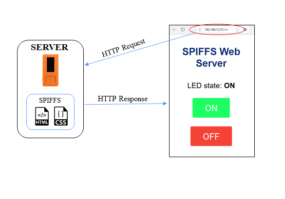
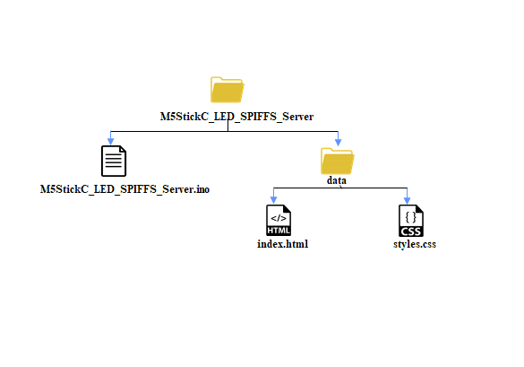

# M5StickC-LED-SPIFFS-Server

 - M5StickC is a mini M5Stack, powered by ESP32. It is a portable, easy-to-use, open source, IoT development board.

- A simple SPIFFS web server is created that controls the LED of M5Stick-C.

- On the previous web server I’ve written the HTML code for the web server as a String directly on the Arduino sketch. In this web server I wrote the HTML and CSS in a separated file  index.html and style.css and save them on the filesystem.
- The server can be accessed by putting the M5StickC IP address on the web browser.

- The web server page shows two buttons: ON and OFF. To turn on the LED click ‘ON’ and click ‘OFF’ to turn off the LED.

## Web Server Flow

## File Hierarchy

